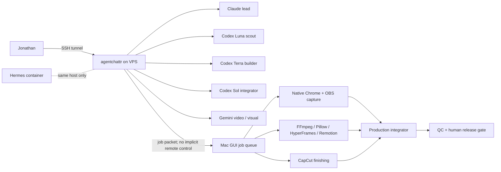

# Hybrid Agent Control Plane and Visual Production Design

**Status:** Proposed design for review
**Date:** 2026-08-07
**Decision already locked:** agentchattr runs beside Hermes on the same VPS as an independent system; native Chrome, OBS, CapCut, and private-media work stay on the Mac.

## 1. Outcome

Build one hybrid production system with two deliberately separate execution environments:

1. A persistent, headless agentchattr control plane on the VPS for planning, research, coding, review, and coordination.
2. An on-demand Mac visual-production island for native-browser capture, local private media, deterministic rendering, and GUI finishing.

Hermes is only a co-tenant on the VPS. It is not agentchattr's parent, supervisor, identity, data store, or message transport.



## 2. Scope and non-goals

### In scope

- Stabilize the existing local agentchattr runtime before moving it.
- Deploy a separately owned and operated agentchattr sidecar on the VPS.
- Preserve the five-role Team Up model: Claude lead, three Codex roles, and Gemini video/visual.
- Establish reproducible local visual lanes for FFmpeg, Pillow, HyperFrames, and Remotion.
- Add a native-Chrome-plus-OBS real-UI capture lane.
- Add an on-demand CapCut computer-use finishing lane.
- Preserve generated/fabricated UI as a later experimental lane governed by examples and explicit standards.

### Out of scope for this design pass

- Installing packages, rendering media, launching Chrome/OBS/CapCut, or operating the browser.
- SSHing to or modifying the VPS.
- Stopping or deleting any current tmux session.
- Changing Hermes, its container, Telegram integration, data, firewall, backups, or watchdog.
- Publishing, uploading, or sending content.
- Defining fabricated-UI visual standards before Jonathan supplies examples.

## 3. Current-state evidence

### Local agent runtime

- Eighteen detached tmux sessions and 23 live panes exist; there are no OS-level zombie processes.
- The only migration candidate is the canonical six-session Team Up group: its server/wrapper owner plus five provider sessions.
- That group is running but not healthy: Claude lead reports `unknown_screen`, aggregate readiness is false, and the five-agent canary is blocked.
- Legacy July sessions, the Metricool wrappers, and the temporary Yap stack are quarantine/retirement candidates, not migration inputs.
- The Yap runtime is especially unsafe to preserve: it points into an already-deleted `/private/tmp` deployment and has a closed Codex proxy.
- All five canonical providers currently share one project directory. Persistent parallel writers require distinct worktrees.
- Live Gemini configuration differs from checked-in configuration. The intended model and environment-file policy must be frozen before migration.

### Local visual tooling

| Tool | Current status | Intended role |
|---|---|---|
| FFmpeg 8.1.1 | Ready at `/opt/homebrew/bin/ffmpeg` | Canonical compositor, normalization, encode, probes, and QC |
| Pillow 12.2.0 | Ready through Python `PIL` | Deterministic still plates, pills, masks, labels, and contact sheets |
| HyperFrames 0.6.25 | Installed at `/Users/jonathan/.nvm/versions/node/v24.14.0/bin/hyperframes` | Bespoke kinetic typography, diagrams, indicators, and transparent overlays |
| Remotion 4.0.441 source | Template and lockfile exist; `node_modules` is absent | Reusable data-driven React compositions |
| Google Chrome 151 | Installed | Real, owned UI interaction through the native Chrome connector |
| OBS 32.1.2 | Installed with obs-websocket plugin; no CLI | Record the native Chrome interaction |
| CapCut 8.9.0 | Installed; GUI only | Optional human-visible finishing after the deterministic master |

Pillow is a Python imaging library, not another editing application. It is useful for reproducible frame graphics that FFmpeg can composite.

## 4. VPS isolation contract

Hermes remains unchanged in its existing container and paths. agentchattr gets its own locked Unix user, files, secrets, processes, tmux sockets, backups, and service names.

```text
Hermes
  existing Docker container and user
  state: /opt/data
  existing dashboard on host port 32772, blocked publicly by the host firewall
  existing watchdog, backups, and firewall

agentchattr
  user:       agentchattr
  releases:   /opt/agentchattr/releases/<git-sha>
  current:    /opt/agentchattr/current -> selected release
  config:     /etc/agentchattr/
  state:      /var/lib/agentchattr/data
  uploads:    /var/lib/agentchattr/uploads
  CLI homes:  /var/lib/agentchattr/home/<role>
  worktrees:  /var/lib/agentchattr/worktrees/<role>
  backups:    /var/backups/agentchattr
```

There will be no shared Hermes volume, token, Telegram identity, Docker network, cron entry, service name, or backup set.

### Network boundary

- Bind agentchattr only to `127.0.0.1`.
- Use `8300`, `8200`, and `8201` only after a live VPS port audit confirms they are free.
- Open no public firewall port and add no public reverse proxy.
- Access the UI from the Mac through an SSH tunnel, for example:

```bash
ssh -L 18300:127.0.0.1:8300 hermes
```

The exact remote port set is a deployment-time fact, not an assumption.

The 2026-08-07 preflight confirmed `8200`, `8201`, and `8300` are free. Hermes' Docker proxy currently binds `32772` on all interfaces, while the persisted firewall blocks public access and the health check requires an SSH tunnel. That existing exception is not the agentchattr pattern: agentchattr must bind loopback directly.

### Filesystem and secret boundary

- Directories containing chat logs, queues, uploads, provider configuration, or prompts are `0700`.
- Secret-bearing files are `0600` and excluded from Git.
- Each provider has a separate CLI home and authentication state.
- OAuth/token homes are not included in ordinary unencrypted backups.
- Private source MP4s remain on the Mac by default. The VPS receives only the minimum job metadata, transcripts, cue sheets, hashes, and approved low-risk derivatives needed for coordination.

## 5. VPS service model

The current development shell launchers must not be installed directly as daemons. They can background the server, attach interactively to tmux, and share the default tmux socket. Before deployment, agentchattr needs an explicit headless wrapper mode or a tested PTY shim, plus a separate tmux socket/runtime directory for every worker.

Target units:

```text
agentchattr.target
├── agentchattr-server.service
├── agentchattr-worker@claude-lead.service
├── agentchattr-worker@codex-luna.service
├── agentchattr-worker@codex-terra.service
├── agentchattr-worker@codex-sol.service
└── agentchattr-worker@gemini-video.service

agentchattr-health.service + timer
agentchattr-backup.service + timer
```

Server policy:

- `User=agentchattr`, `UMask=0077`, `NoNewPrivileges=true`, `PrivateTmp=true`.
- Read-only system paths with explicit write access only to agentchattr state.
- No Linux capabilities.
- Bounded restart policy, file-descriptor limit, task count, memory, and CPU.
- Start providers only after server readiness.

Worker policy:

- Use an explicit absolute worktree and CLI home per role.
- Use an isolated tmux socket/runtime path per role.
- Start with normal approval flow; never migrate dangerous bypass/YOLO launchers to an unrestricted always-on VPS.
- Re-register identity and resume queue watching after a supervised restart.
- Apply resource caps only after measuring live VPS capacity and Hermes headroom.

## 6. Role and work ownership

| Role | Persistent responsibility | Write boundary |
|---|---|---|
| Claude lead | Intake, decomposition, routing, review, release recommendation | Plans/reviews; no overlapping implementation ownership |
| Codex Luna | Read-only scouting, evidence collection, bounded research | No production writes by default |
| Codex Terra | Primary implementation worker | One explicitly assigned worktree/file set |
| Codex Sol | Integration, tests, conflict resolution, acceptance evidence | Integration worktree only |
| Gemini video | Visual analysis, layout/motion critique, visual acceptance support | Visual artifacts/specs explicitly assigned to it |

One job has one owner. Parallel agents may work only on independent artifacts or separate worktrees. No two agents receive overlapping write ownership.

## 7. Job contract between VPS and Mac

The VPS does not directly seize Mac GUI state. It produces a bounded job packet that an on-demand Mac worker accepts.

```text
job.json
  job_id
  requested_lane
  approved_inputs and SHA-256 hashes
  cue_sheet or capture_spec
  expected outputs
  forbidden actions
  validation gates
  output directory
  human approval state
```

Every lane returns:

```text
result.json
  job_id
  status
  tool versions
  commands or action log
  output hashes
  QC receipts
  deviations and blockers
```

GUI jobs are serialized through one Mac ownership lock. Chrome, OBS, and CapCut must never be driven concurrently by different agents.

## 8. Visual production lanes

### Lane A: deterministic local composition

This is the canonical baseline and final QC authority.

1. FFmpeg probes and normalizes inputs.
2. Pillow creates deterministic static graphic assets.
3. HyperFrames supplies transparent motion overlays where bespoke motion is justified.
4. Remotion supplies reusable, data-driven compositions.
5. FFmpeg performs the final assembly and produces machine-readable probes, contact sheets, loudness reports, and hashes.

Readiness gates:

- FFmpeg/Pillow produce a one-second 1080x1920 H.264/AAC smoke with exactly 30 video frames.
- HyperFrames contains no `http://` or `https://` runtime dependency. Its current GSAP CDN reference must be replaced by a locally vendored exact version.
- HyperFrames `lint`, strict `inspect`, render, alpha-channel probe, and hero-frame checks pass. Version 0.6.25 does not expose the documented `validate` command.
- Remotion dependencies are restored with `npm ci` from the existing lockfile.
- Remotion's Google-font loaders are replaced with approved local font files before it is called offline-safe.
- Remotion uses a unique job output path because its configuration allows output overwrite.
- Neither renderer imports stale Lindsay visuals, stock, CTA, palette, or template defaults.

HyperFrames is the preferred bespoke motion-overlay lane. Remotion is the preferred reusable React composition lane. Neither creates proof UI when the real application can be recorded.

### Lane B: real-owned UI capture

One Mac Capture Agent owns native Chrome and OBS for the complete take.

Required `capture_spec.json`:

- Exact application, account, and URL.
- Approved starting and stopping states.
- Ordered actions and cue timings.
- Viewport/crop.
- Sensitive regions to exclude.
- Forbidden actions.

Procedure:

1. Human resolves login and macOS capture permissions when needed.
2. Agent inspects existing native Chrome tabs and reuses one correct target tab.
3. Agent verifies the exact account/app/state and exclusion of private UI.
4. OBS records a fixed 1080x1920, 30 fps window-capture scene.
5. The Codex capture worker performs only the approved actions in native Chrome.
6. Agent stops OBS and FFmpeg normalizes the local MKV to a deterministic MP4.
7. QC verifies account, action order, legibility, dropped frames, focus, notifications, secrets, unrelated tabs, cursor errors, and hashes.

The browser lane never inspects cookies, passwords, storage, unrelated profiles, or unrelated tabs. Real UI is labeled as real capture, never as generated simulation.

### Lane C: CapCut finishing

CapCut is an optional, serialized review/finishing pass after the deterministic master exists.

Inputs:

- `deterministic-master.mp4`
- `capcut-edit-spec.json`
- Approved local asset manifest and reference frames
- Explicit unique export path

Boundaries:

- Import only approved local assets.
- Do not download templates, effects, stock, or fonts.
- Do not cloud-sync, upload, schedule, or publish.
- Never overwrite the deterministic master.
- Re-read GUI state after every operation; do not reuse stale element indexes.
- Export one review file, run full transcript/visual/audio/cue-sheet QC, then stop.

CapCut is not the canonical compositor because its GUI state, re-encoding, fonts, effects, captions, and account dependencies are harder to reproduce. The FFmpeg master remains the recovery baseline.

### Lane D: fabricated UI experiment

This lane remains available but deferred. It begins only after Jonathan supplies accepted and rejected examples and approves standards for realism, labeling, text accuracy, provenance, and permissible use cases. Remotion's current synthetic screenshot/cursor composition belongs here, not in the real-UI proof lane.

## 9. Stabilization and rollout order

### Phase 0 — preserve and map

- Snapshot the exact session/process/port/worktree map.
- Preserve required conversation or work context before any retirement.
- Name one canonical Team Up revision and port map.
- Freeze the intended Gemini model and configuration source.
- Confirm clean, reproducible deployment inputs without cleaning or altering Jonathan's existing dirty worktrees.

Gate: no unknown owner, port collision, untracked deployment dependency, or unresolved context-retention decision.

### Phase 1 — repair the local canonical runtime

- Repair Claude lead's `unknown_screen` state.
- Require provider-aware readiness for all five roles.
- Pass a bounded five-agent canary.
- Prove separate role worktrees and no overlapping writes.
- Add log rotation and bounded recovery behavior.

Gate: aggregate readiness true, canary passed, and restart recovery proven. Do not migrate a broken local topology.

### Phase 2 — ready the headless visual tools

Run three independently owned preparation tasks in parallel:

1. FFmpeg/Pillow deterministic smoke.
2. HyperFrames offline hardening and smoke.
3. Remotion dependency restoration, local-font conversion, and smoke.

Final render smokes run sequentially to avoid CPU contention.

Gate: offline-local render, exact media contract, clean QC receipts, no remote runtime asset.

### Phase 3 — establish serialized Mac GUI lanes

- Build and dry-run the Chrome/OBS capture specification and action log.
- Build and dry-run the CapCut edit specification and export/QC contract.
- Enforce one Mac GUI owner/lock.

Gate: no accidental external action, private-data leak, uncontrolled GUI concurrency, or overwrite of canonical media.

### Phase 4 — prepare the VPS sidecar

- Verify Hermes health first, then inventory host capacity, ports, services, timers, firewall, dependencies, and OOM history.
- Implement/test headless wrapper behavior locally.
- Pin the deploy Git SHA and exact Python dependencies.
- Create the dedicated user, paths, permissions, isolated homes, worktrees, units, health timer, and encrypted backup timer.
- Tunnel to the localhost-only server and test one non-bypass worker before enabling all five.

Gate: Hermes stays green; no public listener; server and each worker survive restart; backup and isolated restore succeed.

### Phase 5 — dual-run and cut over

- Use separate rooms and worktrees for local and VPS tests to prevent duplicate job execution.
- Run bounded read-only canaries per provider and one five-agent workflow.
- Observe resource use, logs, queue recovery, browser-token behavior, and Hermes health.
- Cut over only headless orchestration. Mac GUI and private-media lanes remain local.

Gate: clean observation window and explicit human approval.

### Phase 6 — retire only after approval

- Present the legacy July, Metricool-wrapper, and Yap session/context inventory.
- Retire only explicitly approved targets.
- Keep Metricool's app server local/on-demand if still needed; it is not part of the control plane.

## 10. Failure handling

| Failure | Required behavior |
|---|---|
| Hermes health degrades | Stop agentchattr rollout; leave Hermes unchanged; diagnose host contention |
| Provider loses identity/heartbeat | Mark aggregate health false; stop routing new jobs to it; bounded restart |
| Server restarts/browser token changes | Re-establish the SSH tunnel/session; do not expose the service publicly |
| Worker leaves orphaned tmux process | Health check detects duplicate/unknown socket; quarantine role before restart |
| Mac GUI lock is held/stale | Do not drive Chrome, OBS, or CapCut; require ownership verification/recovery |
| Capture exposes sensitive UI | Reject artifact, retain only according to the job's privacy rule, and recapture after human review |
| Renderer requests network asset | Fail closed; vendor or replace the dependency before rerun |
| CapCut export drifts from master | Reject CapCut output and fall back to deterministic FFmpeg master |
| Parallel write collision | Stop both writers; preserve patches; reassign non-overlapping worktrees |

## 11. Acceptance criteria

The hybrid system is ready only when all are true:

- Hermes is healthy and demonstrably independent before, during, and after cutover.
- agentchattr is localhost-only, separately owned, separately backed up, and separately authenticated.
- All five provider roles are healthy, recoverable, and canary-tested without approval bypasses.
- Each writer has an explicit worktree and non-overlapping ownership.
- Job packets and result receipts cross the VPS/Mac boundary without moving private source media by default.
- FFmpeg/Pillow, HyperFrames, and Remotion pass offline deterministic smokes.
- Chrome/OBS and CapCut lanes are serialized, logged, reversible, and human-gated where authentication or release requires it.
- Real UI provenance is explicit; fabricated UI remains experimental and governed by later-approved standards.
- No legacy session is retired without context preservation and explicit approval.

## 12. Implementation-plan decomposition

After this design is approved, implementation should be planned as six bounded plans rather than one high-risk migration:

1. Local agentchattr stabilization and canonical-session recovery.
2. FFmpeg/Pillow, HyperFrames, and Remotion local readiness.
3. Native Chrome plus OBS capture lane.
4. CapCut computer-use finishing lane.
5. VPS sidecar preflight and deployment.
6. Fabricated-UI standards and experimental lane, after examples are provided.

The first implementation plan should be local agentchattr stabilization. It removes the current readiness blocker without touching Hermes or the VPS.
